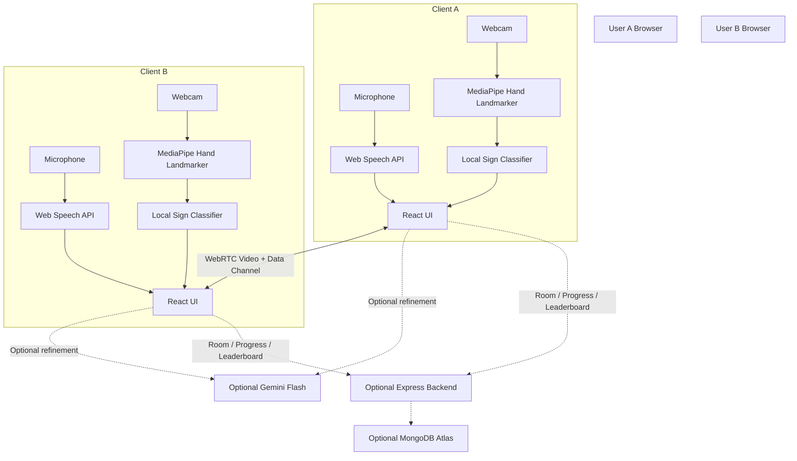
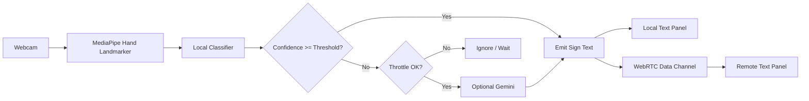
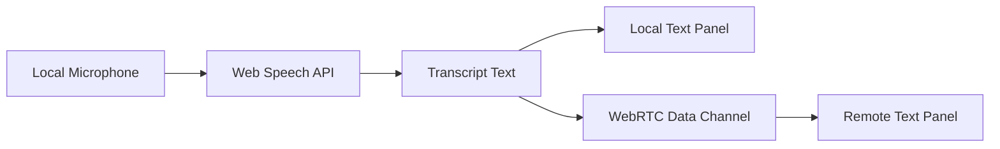

# Ishara – System Architecture

## 1. Executive Summary

Ishara is a browser-based 1:1 communication prototype built for a 24-hour hackathon.

It enables two participants to exchange text derived from a small fixed vocabulary of isolated hand signs and spoken language while conducting a video call.

### Core Design Principles

- Client-side recognition for low latency and privacy
- Isolated-sign recognition only, limited to 5–8 validated static signs
- Graceful degradation when optional services are unavailable
- Minimal backend surface area
- Demo-grade reliability under controlled conditions
- Browser-native capabilities wherever possible
- Clear separation between required and optional components

The architecture prioritizes simplicity, privacy, low infrastructure requirements, and reliable execution within the 24-hour hackathon constraint.

---

# 2. High-Level Architecture



The primary communication path is peer-to-peer through WebRTC.

Recognition happens locally inside each participant's browser. The backend and Gemini are optional supporting services and are never part of the critical communication path.

---

# 3. Component Breakdown

| Component                 | Responsibility                                                     | Location     | Required / Optional |
| ------------------------- | ------------------------------------------------------------------ | ------------ | ------------------- |
| React Frontend            | UI, video elements, text panels, practice module, state management | Browser      | Required            |
| MediaPipe Hand Landmarker | Extract 21 hand landmarks from webcam frames at 15–30 FPS          | Browser      | Required            |
| Local Classifier          | Map landmark vectors to one of the fixed 5–8 signs                 | Browser      | Required            |
| Web Speech API            | Real-time speech-to-text on the speaking participant               | Browser      | Required            |
| WebRTC / Stream Video     | 1:1 video streams + data channel for text exchange                 | Browser      | Required            |
| Gemini Flash              | Low-frequency refinement of uncertain detections                   | External API | Optional            |
| Express Backend           | Room management, progress, badges, leaderboard                     | Server       | Optional            |
| MongoDB Atlas             | Persist practice progress and leaderboard entries                  | Cloud        | Optional            |

---

# 4. Service Boundaries

## 4.1 Client Boundary

All primary recognition happens inside the browser:

```text
Webcam
   ↓
MediaPipe
   ↓
Local Classifier
   ↓
Recognized Sign
```

Raw video frames and hand landmarks do not leave the device on the primary recognition path.

Speech recognition is also performed on the speaking participant's client.

---

## 4.2 Data Channel Boundary

Only recognized information is exchanged between peers.

The data channel carries:

- Recognized sign text
- Speech transcript text
- Confidence information
- Timestamps
- Optional control messages

Raw video processing is not performed through the data channel.

---

## 4.3 Backend Boundary

The optional backend is responsible only for lightweight application functionality:

- Room creation
- Room joining
- Practice progress
- Badges
- Leaderboard data

The backend does **not** process:

- Video
- Audio
- Webcam frames
- Hand landmarks

No long-lived backend connection is required for the core video and recognition experience.

---

## 4.4 AI Boundary

Gemini is an optional fallback mechanism.

It is invoked only when:

1. The local classifier has low confidence.
2. The request passes the configured throttle.
3. No suitable cached result is available.

Gemini is never part of the critical path.

```text
Local Classifier
       ↓
Confidence Check
       ↓
 ┌─────┴─────┐
 │           │
High       Low
 │           │
 ↓           ↓
Emit     Throttle Check
             ↓
       Optional Gemini
             ↓
          Emit Result
```

---

# 5. Data Flow

## 5.1 Sign → Text Path

The primary sign recognition pipeline is:



### Primary Path

```text
Webcam
   ↓
MediaPipe
   ↓
21 Hand Landmarks
   ↓
Local Classifier
   ↓
Confidence Check
   ↓
Recognized Sign
   ↓
Local UI + WebRTC Data Channel
   ↓
Remote Text Panel
```

The local classifier is always the first recognition mechanism.

---

# 6. Speech → Text Path

Speech recognition follows a similar client-first architecture.



The speaking participant's browser converts speech into text.

The resulting transcript is then:

1. Displayed locally.
2. Sent to the other participant through the WebRTC data channel.

No server-side audio processing is required.

---

# 7. Practice Mode

Practice mode reuses the exact same recognition pipeline used during communication.

```text
Webcam
   ↓
MediaPipe Hand Landmarker
   ↓
Local Classifier
   ↓
Detected Sign
   ↓
Compare With Target Sign
   ↓
Success / Retry
   ↓
Optional Progress Persistence
```

The target sign is stored locally during the exercise.

The result can optionally be persisted through the backend for:

- Progress tracking
- Badges
- Leaderboard entries

This avoids building a second recognition system specifically for practice mode.

---

# 8. Request Lifecycle

The backend is optional and exists only when persistent application features are enabled.

### Room Lifecycle

```text
Client
  ↓
Create / Join Room
  ↓
Backend
  ↓
Room ID / Optional Token
  ↓
WebRTC Connection
  ↓
Peer-to-Peer Communication
```

### Progress Lifecycle

```text
Practice Session
      ↓
Result Generated
      ↓
Client Sends POST Request
      ↓
Backend
      ↓
Database
```

### Leaderboard Lifecycle

```text
Client
   ↓
GET /leaderboard
   ↓
Backend
   ↓
MongoDB
   ↓
Ranked Results
   ↓
Client UI
```

The backend does not sit in the media or recognition path.

---

# 9. API Design

## 9.1 WebRTC Data Channel

Messages are exchanged as JSON over the WebRTC data channel.

### Sign Message

```json
{
  "type": "sign",
  "text": "Hello",
  "confidence": 0.87,
  "timestamp": 1726000000000
}
```

### Speech Message

```json
{
  "type": "speech",
  "text": "How are you?",
  "isFinal": true,
  "timestamp": 1726000000000
}
```

### Message Types

| Type      | Purpose                                |
| --------- | -------------------------------------- |
| `sign`    | Recognized hand sign                   |
| `speech`  | Speech-to-text transcript              |
| `control` | Optional communication/control message |

The data channel intentionally remains lightweight and text-oriented.

---

# 10. Optional Backend REST API

| Method | Endpoint            | Purpose                       |
| ------ | ------------------- | ----------------------------- |
| POST   | `/rooms`            | Create a room                 |
| POST   | `/rooms/:id/join`   | Join an existing room         |
| GET    | `/progress/:userId` | Fetch practice progress       |
| POST   | `/progress`         | Save practice result or badge |
| GET    | `/leaderboard`      | Fetch ranked leaderboard      |

The API contracts are intentionally minimal to keep the backend easy to implement and debug during the hackathon.

Authentication is not mandatory for the pure peer-to-peer demo path.

If authentication is implemented for the full demo, room tokens or simple JWT-based authentication can be used.

---

# 11. Folder Structure

```text
ishara/
│
├── public/
│
├── src/
│   ├── components/
│   │   ├── VideoCall/
│   │   ├── TextPanel/
│   │   ├── Practice/
│   │   └── Leaderboard/
│   │
│   ├── hooks/
│   │   ├── useMediaPipe.js
│   │   ├── useLocalClassifier.js
│   │   ├── useSpeechRecognition.js
│   │   └── useWebRTC.js
│   │
│   ├── lib/
│   │   ├── classifier/
│   │   ├── gemini/
│   │   │   ├── throttle.js
│   │   │   └── cache.js
│   │   │
│   │   └── constants.js
│   │
│   ├── pages/
│   │
│   ├── App.jsx
│   └── main.jsx
│
├── server/
│   ├── routes/
│   ├── models/
│   └── index.js
│
├── .env.example
└── package.json
```

`server/` is optional and can be omitted when running the pure peer-to-peer prototype.

---

# 12. Design Decisions

| Decision                                                 | Rationale                                                                              | Trade-off                                                   |
| -------------------------------------------------------- | -------------------------------------------------------------------------------------- | ----------------------------------------------------------- |
| Client-side MediaPipe + local classifier as primary path | Zero cost, low latency, privacy-preserving                                             | Limited vocabulary and lighting-dependent accuracy          |
| Isolated static signs only                               | Achievable and reliable within 24 hours                                                | Does not support continuous signing or sentence translation |
| Web Speech API on speaking client                        | Free, real-time, no server audio processing                                            | Browser support and accent limitations                      |
| Gemini as a throttled fallback                           | Provides AI-assisted refinement without making the system dependent on an external API | Additional complexity and rate-limit considerations         |
| Text-only data channel                                   | Simple, low bandwidth, easy to debug                                                   | No rich gesture replay or gesture media exchange            |
| Optional thin backend                                    | Allows the core demo to remain peer-to-peer while supporting persistence               | Progress and leaderboard require backend infrastructure     |
| No server-side video processing                          | Simple, cheap, privacy-preserving                                                      | Server-side recognition improvements are not possible       |

---

# 13. Reliability Strategy

Ishara uses a layered reliability model.

```text
                 Ishara Recognition
                        │
              ┌─────────┴─────────┐
              │                   │
        Primary Path        Optional Path
              │                   │
       Local Classifier        Gemini
              │                   │
       Always Available       Throttled
              │                   │
              └─────────┬─────────┘
                        ↓
                  Final Result
```

The system should continue operating even when optional services fail.

### Examples

**If Gemini fails:**

```text
Local Classifier → Continue Recognition
```

**If backend fails:**

```text
Video + Recognition → Continue
Progress / Leaderboard → Temporarily Unavailable
```

**If speech recognition is unsupported:**

```text
Sign Recognition + Video → Continue
Speech Feature → Disabled With Clear UI Message
```

This ensures that optional features never become single points of failure for the core demo.

---

# 14. Risks and Mitigation

| Risk                            | Impact                           | Mitigation                                                    |
| ------------------------------- | -------------------------------- | ------------------------------------------------------------- |
| Poor lighting or hand angle     | Recognition accuracy decreases   | Controlled demo environment and visible confidence indicator  |
| Gemini rate limits              | Fallback unavailable             | Local classifier remains primary; throttle and cache requests |
| Web Speech browser support      | Speech path may not work         | Feature detection and Chrome recommendation                   |
| WebRTC connectivity             | Call may fail behind strict NATs | Use TURN where required                                       |
| Scope creep into continuous ISL | Deadline risk                    | Explicit vocabulary limit of 5–8 isolated signs               |
| Landmark noise                  | Unstable predictions             | Temporal smoothing and confidence threshold                   |
| External API failure            | AI refinement unavailable        | Treat Gemini as strictly optional                             |
| Backend failure                 | Progress features unavailable    | Core communication remains peer-to-peer                       |

---

# 15. Security and Privacy Considerations

Ishara follows a client-first privacy model.

### Webcam and Landmark Data

Raw webcam frames and hand landmarks remain on the client during the primary recognition path.

### Network Data

Only recognized text and required control information are exchanged between peers.

### Gemini

When Gemini is used, only limited information should be sent:

- Rounded landmark coordinates, or
- A tightly cropped hand region

The full webcam frame should not be sent to Gemini.

### Persistent Media

The prototype does not persist:

- Video recordings
- Audio recordings
- Raw webcam frames

### Backend

The optional backend can use simple JWT or room-token authentication when authentication is required.

### Secrets

API keys and other credentials must be loaded through environment variables and must never be committed to the repository.

Example:

```text
.env
├── GEMINI_API_KEY
├── STREAM_API_KEY
└── other secrets
```

Only `.env.example` should be committed.

---

# 16. Scalability Considerations

The primary recognition pipeline is client-side.

Therefore:

```text
More Users
    ↓
More Browser Sessions
    ↓
More Client-side Compute
```

rather than:

```text
More Users
    ↓
More Server Recognition Requests
    ↓
Higher Server Compute Cost
```

The optional backend only handles lightweight application operations such as:

- Room coordination
- Progress
- Badges
- Leaderboard

For hackathon-scale usage, a lightweight Express backend with a free-tier database is sufficient.

Gemini requests are deliberately rate-limited to a few requests per minute per client.

No video transcoding or dedicated media server is required for the 1:1 prototype.

---

# 17. Production Scaling Considerations

The current architecture is intentionally designed for a hackathon prototype.

A production system would require additional infrastructure, including:

- Dedicated media infrastructure
- Larger and continuously trained recognition models
- Proper authentication
- Multi-tenancy
- Horizontal backend scaling
- Stronger monitoring and observability
- Formal model evaluation
- Improved accessibility testing
- More comprehensive privacy controls

These requirements are explicitly outside the scope of the current 24-hour prototype.

---

# 18. Future Improvements

Potential future extensions include:

1. Expand the validated sign vocabulary with carefully collected landmark data.
2. Replace the rule-based or distance-based classifier with a small on-device neural network.
3. Add continuous recognition for short phrases.
4. Support multi-party rooms.
5. Improve offline speech recognition alternatives.
6. Add keyboard navigation.
7. Add high-contrast themes.
8. Add screen-reader labels.
9. Introduce formal evaluation metrics.
10. Build a dedicated test set for the supported vocabulary.

---

# 19. Assumptions

The architecture assumes:

- Users have modern Chromium-based browsers.
- Camera and microphone permissions are available.
- The demonstration environment provides reasonable lighting.
- The hand remains clearly visible to the camera.
- Network conditions allow basic WebRTC connectivity.
- TURN is available if direct peer-to-peer connectivity fails.
- The supported vocabulary remains limited to 8 signs or fewer.
- Gemini free-tier limits are acceptable because it is not part of the critical path.
- The project remains a 1:1 communication prototype during the hackathon.

---

# 20. Alternatives Considered

## Full Continuous ISL Recognition

**Rejected for the current prototype.**

Continuous sign-language recognition requires significantly more data, temporal modeling, training, and validation.

The prototype therefore focuses on a small set of isolated static signs.

---

## Server-side Recognition

**Rejected for the primary path.**

Reasons:

- Additional infrastructure
- Higher latency
- Increased cost
- Privacy concerns
- More complex deployment

Client-side recognition is sufficient for the controlled prototype.

---

## Pure MediaPipe Gesture Recognition

**Rejected as insufficient.**

MediaPipe provides hand landmarks, but the project requires recognition of a curated vocabulary.

Therefore, a local classifier is placed after landmark extraction.

```text
MediaPipe
   ↓
Landmarks
   ↓
Local Classifier
   ↓
Supported Sign
```

---

## Always-on Gemini Recognition

**Rejected.**

Reasons:

- API dependency
- Rate limits
- Additional latency
- Increased complexity
- Potential cost

Gemini is therefore used only as an optional, throttled fallback.

---

# 21. Accepted Trade-offs

The architecture deliberately accepts several trade-offs.

### Accuracy vs. Scope

A small validated vocabulary provides more predictable recognition than attempting full continuous sign-language translation within 24 hours.

### Privacy vs. Model Complexity

Keeping recognition on-device reduces privacy risks but limits the complexity of models that can be used.

### Infrastructure vs. Simplicity

The peer-to-peer approach reduces infrastructure requirements but introduces WebRTC connectivity considerations.

### Browser Compatibility vs. Zero Installation

Browser-native APIs provide a zero-install experience but introduce browser-specific limitations.

### AI Capability vs. Reliability

Gemini adds optional intelligence but is intentionally prevented from becoming a dependency of the core system.

---

# 22. Final Architecture Summary

Ishara is intentionally built around a **client-first, peer-to-peer architecture**.

The critical path is:

```text
                ISHARA CORE PATH

        ┌───────────────────────────┐
        │       Browser Client      │
        │                           │
        │ Webcam → MediaPipe        │
        │              ↓            │
        │       Local Classifier    │
        │              ↓            │
        │       Recognized Text     │
        │              ↓            │
        │       React Interface     │
        └─────────────┬─────────────┘
                      │
                      │ WebRTC
                      │
                      ↓
        ┌───────────────────────────┐
        │       Remote Browser      │
        │                           │
        │    Remote Text Panel      │
        │           +               │
        │       Video Stream        │
        └───────────────────────────┘
```

Optional capabilities surround this core:

```text
                 ┌───────────────┐
                 │    Gemini     │
                 │   Fallback    │
                 └───────┬───────┘
                         │
                         ↓
                Local Recognition
                         │
                         │
┌────────────────────────┼────────────────────────┐
│                        │                        │
│                 CORE PEER PATH                  │
│                        │                        │
│              WebRTC Video + Data                │
│                        │                        │
└────────────────────────┼────────────────────────┘
                         │
                         ↓
                Optional Backend
                         │
                         ↓
                  MongoDB Atlas
```

The architecture is intentionally conservative.

It prioritizes:

- Working functionality
- Clear component boundaries
- Client-side privacy
- Low latency
- Minimal infrastructure
- Graceful failure
- Easy debugging
- Reliable hackathon demonstration

This makes the system achievable within a 24-hour build window while leaving clear extension points for future development.
